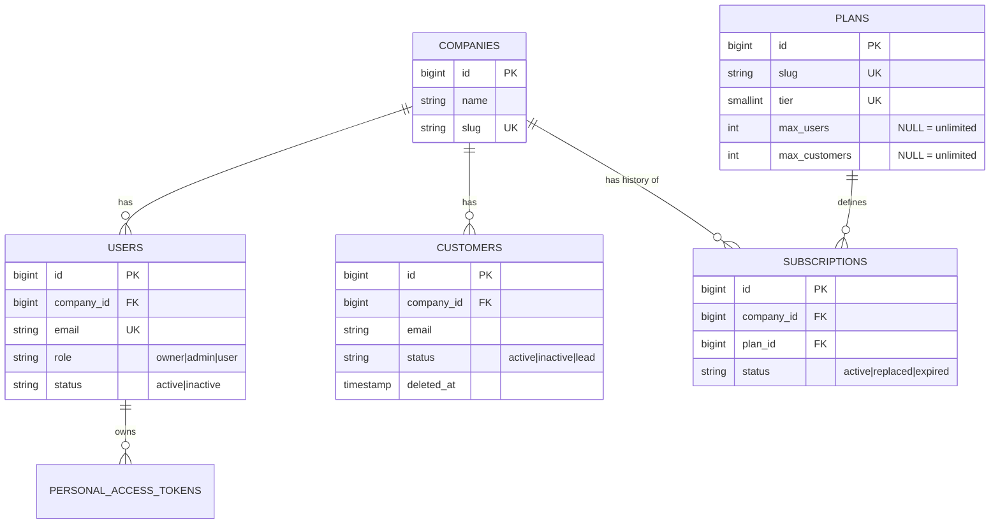

# DATABASE

PostgreSQL 16. Shared database, shared schema; tenant = `companies` row; tenant-owned tables carry `company_id`.
Migrations are **written with the CRUD step that needs them** (see `PLAN.md` section 13); this file is the full design they follow.

## 1. ERD

## 2. Tenant ownership

| Table                    | Tenant column             | Notes                                  |
| ------------------------ | ------------------------- | -------------------------------------- |
| `companies`              | `id` **is** the tenant id | tenant root                            |
| `users`                  | `company_id`              | one company per user                   |
| `customers`              | `company_id`              |                                        |
| `subscriptions`          | `company_id`              | history per company, one active        |
| `plans`                  | none                      | global catalogue, read-only to tenants |
| `personal_access_tokens` | via `tokenable` -> user   | revoked per user                       |
| `failed_jobs`            | none                      | infrastructure                         |

No Redis/DB sessions: API is token-based; cache/queue use Redis.

## 3. Tables

### plans

| Column                 | Type         | Constraints                                     |
| ---------------------- | ------------ | ----------------------------------------------- |
| id                     | bigint       | PK                                              |
| slug                   | varchar(50)  | UNIQUE (`free`,`pro`,`enterprise`)              |
| name                   | varchar(100) | NOT NULL                                        |
| tier                   | smallint     | UNIQUE, NOT NULL (1,2,3): defines upgrade order |
| price_cents            | integer      | NOT NULL default 0, CHECK >= 0                  |
| max_users              | integer      | NULL = unlimited, CHECK > 0                     |
| max_customers          | integer      | NULL = unlimited, CHECK > 0                     |
| features               | jsonb        | NOT NULL default `{}`                           |
| is_active              | boolean      | NOT NULL default true                           |
| created_at, updated_at | timestamp    |                                                 |

Seed: Free (tier 1, 5 users, 100 customers), Pro (tier 2, 50, 5000), Enterprise (tier 3, unlimited: assumption).

### companies

| Column                 | Type         | Constraints       |
| ---------------------- | ------------ | ----------------- |
| id                     | bigint       | PK                |
| name                   | varchar(255) | NOT NULL          |
| slug                   | varchar(255) | UNIQUE, immutable |
| created_at, updated_at | timestamp    |                   |

The owner is **not** stored on `companies` (avoids a circular FK with `users`); it is the user with `role='owner'`, guaranteed unique per company by an index on `users`.

### subscriptions

| Column                 | Type        | Constraints                              |
| ---------------------- | ----------- | ---------------------------------------- |
| id                     | bigint      | PK                                       |
| company_id             | bigint      | FK -> companies ON DELETE CASCADE        |
| plan_id                | bigint      | FK -> plans ON DELETE RESTRICT           |
| status                 | varchar(20) | CHECK in (`active`,`replaced`,`expired`) |
| starts_at              | timestamp   | NOT NULL                                 |
| ends_at                | timestamp   | NULL                                     |
| created_at, updated_at | timestamp   |                                          |

### users

| Column                 | Type         | Constraints                                      |
| ---------------------- | ------------ | ------------------------------------------------ |
| id                     | bigint       | PK                                               |
| company_id             | bigint       | FK -> companies ON DELETE CASCADE, NOT NULL      |
| name                   | varchar(255) | NOT NULL                                         |
| email                  | varchar(255) | NOT NULL, stored lowercase                       |
| password               | varchar(255) | NOT NULL (hashed)                                |
| role                   | varchar(20)  | CHECK in (`owner`,`admin`,`user`)                |
| status                 | varchar(20)  | CHECK in (`active`,`inactive`), default `active` |
| created_at, updated_at | timestamp    |                                                  |

Hard delete (tokens removed with the user).

### customers

| Column                 | Type         | Constraints                                             |
| ---------------------- | ------------ | ------------------------------------------------------- |
| id                     | bigint       | PK                                                      |
| company_id             | bigint       | FK -> companies ON DELETE CASCADE, NOT NULL             |
| name                   | varchar(255) | NOT NULL                                                |
| email                  | varchar(255) | NOT NULL, stored lowercase                              |
| phone                  | varchar(50)  | NULL                                                    |
| status                 | varchar(20)  | CHECK in (`active`,`inactive`,`lead`), default `active` |
| notes                  | text         | NULL                                                    |
| created_at, updated_at | timestamp    |                                                         |
| deleted_at             | timestamp    | NULL (soft delete)                                      |

### personal_access_tokens

Laravel Sanctum standard table (`tokenable_type`, `tokenable_id`, `name`, `token` UNIQUE, `abilities`, `last_used_at`, `expires_at`, timestamps).

### failed_jobs

Laravel standard (uuid, connection, queue, payload, exception, failed_at).

## 4. Indexes and why

| Table         | Index                                                       | Type                  | Serves                                                                                        |
| ------------- | ----------------------------------------------------------- | --------------------- | --------------------------------------------------------------------------------------------- |
| plans         | `(slug)`, `(tier)`                                          | unique                | lookup by slug; upgrade comparison                                                            |
| companies     | `(slug)`                                                    | unique                | slug uniqueness                                                                               |
| subscriptions | `(company_id) WHERE status='active'`                        | **partial unique**    | "one active subscription per company" **and** the hot query "current subscription of company" |
| subscriptions | `(company_id, starts_at)`                                   | btree                 | subscription history list                                                                     |
| subscriptions | `(plan_id)`                                                 | btree                 | FK check on plan RESTRICT                                                                     |
| users         | `(lower(email))`                                            | **functional unique** | case-insensitive global uniqueness + login lookup                                             |
| users         | `(company_id) WHERE role='owner'`                           | **partial unique**    | exactly one owner per company at DB level                                                     |
| users         | `(company_id, role)`                                        | btree                 | filter by role; also user COUNT per company (leading `company_id`)                            |
| users         | `(company_id, status)`                                      | btree                 | filter by status                                                                              |
| users         | `(company_id, created_at, id)`                              | btree                 | default sort + stable keyset-friendly pagination                                              |
| customers     | `(company_id, lower(email)) WHERE deleted_at IS NULL`       | **partial unique**    | per-company email uniqueness among live rows                                                  |
| customers     | `(company_id, created_at, id) WHERE deleted_at IS NULL`     | partial btree         | default list order, pagination, limit COUNT                                                   |
| customers     | `(company_id, status, created_at) WHERE deleted_at IS NULL` | partial btree         | `?status=` filter + sort                                                                      |
| customers     | trigram GIN on `lower(name)`, `lower(email)`                | optional (step 14)    | `?search=` with `ILIKE '%x%'`; added only if `EXPLAIN` shows need                             |

Rules followed: `company_id` is the **leading** column of every tenant index (every query is tenant-filtered); partial indexes match the always-on soft-delete filter so they stay small; FK columns are indexed; no index without a query that uses it.

## 5. Hot queries -> index

| Query                                           | Index used                                        |
| ----------------------------------------------- | ------------------------------------------------- |
| active subscription + plan for company (cached) | subscriptions partial unique, eager load `plan`   |
| `COUNT(*)` users/customers for limit/usage      | `users(company_id, ...)`, customers partial index |
| `GET /customers?status=active&page=2`           | `(company_id, status, created_at)` partial        |
| `GET /customers` default                        | `(company_id, created_at, id)` partial            |
| login by email                                  | `lower(email)` unique                             |

Pagination: offset pagination with `per_page <= 100` and a stable `ORDER BY created_at DESC, id DESC`; selects only needed columns; relations eager loaded (`with()`), `preventLazyLoading` on outside production to catch N+1.

## 6. Integrity rules at DB level

- FKs everywhere; CASCADE from company (tenant removal), RESTRICT on plan.
- CHECK constraints mirror enums (role, statuses, non-negative price, positive limits).
- Partial unique indexes enforce: one active subscription, one owner, unique live customer email.
- Laravel migrations create partial/functional indexes with `DB::statement(...)` (query builder can't express them).

## 7. Deletes and retention

| Entity        | Delete          | Effect on limits                  |
| ------------- | --------------- | --------------------------------- |
| users         | hard            | frees a seat; tokens cascade      |
| customers     | soft            | frees a slot; no restore endpoint |
| subscriptions | never (history) | n/a                               |
| companies     | no endpoint     | n/a                               |

## 8. Migration order

`plans` -> `companies` -> `subscriptions` -> `users` -> `personal_access_tokens` -> `customers` -> `failed_jobs`
(written in steps 4, 6, 10; `failed_jobs` in step 13).
